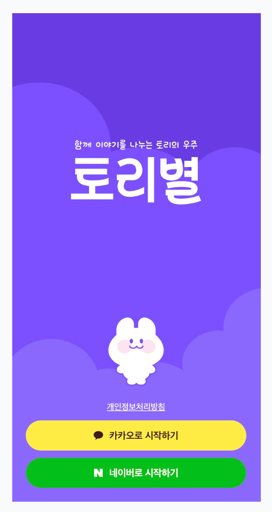
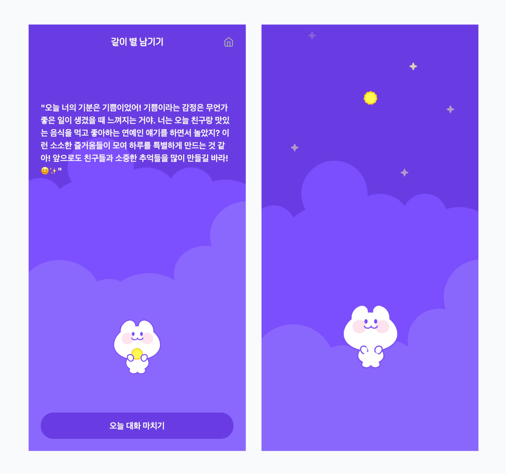

# 토리별

<div  align="center">

</div>

#### 비사이드 502 ai 포텐데이 x 네이버 Cloud에서 진행한 프로젝트입니다.

<br/>

# 📝 프로젝트 개요

**프로젝트 명:** 토리별

**프로젝트 설명:** 아이와 감정을 나누고 소통하는 새로운 방법을 제시하는 ai 채팅 서비스

**프로젝트 기간:** 2025.02.21 ~ 2024.03.12

**배포 주소:** https://toristar.site/onboarding

<br/>

## 👏 팀원

<table align="center">
    <tbody>
        <tr>
            <td>
                <a href="https://github.com/tkddbs587">
                    
                </a>
            </td>
            <td>
                <a href="https://github.com/ralla0405">
                    
                </a>
            </td>
            <td>
                <a href="https://github.com/hyunw405">
                    
                </a>  
            </td>
            <td>
                <div>
                    
                </div>  
            </td>
            <td>
                <div>
                    
                </div>
            </td>
        </tr>
        <tr>
            <th>
                <a href="https://github.com/tkddbs587">이영훈</a>
            </th>
            <th>
                <a href="https://github.com/ralla0405">정승환</a>
            </th>
            <th>
                <a href="https://github.com/hyunw405">백현우</a>
            </th>
            <th>
                <div>김세민</div>
            </th>
            <th>
                <div>전단비</div>
            </th>
        </tr>
        <tr>
            <th>
                FrontEnd
            </th>
            <th>
                BackEnd
            </th>
            <th>
                AI
            </th>
            <th>
                PM
            </th>
            <th>
                Designer
            </th>
        </tr>
    </tbody>
</table>

<br/>

# 🛠️ 기술 스택

## FrontEnd

<div  align="center">


</div>

<!--  -->

## ETC

<div  align="center">
   
<br>
 
</div>

<br/>

# 🗂️ 디렉토리 구조

```
📦 Root
┣ 📂 .github                # GitHub 설정 파일 및 워크플로
┣ 📂 .husky                 # Git Hooks 설정 폴더
┣ 📂 public                 # 정적 파일 (이미지, svg 등)
┣ 📂 src                    # 소스 코드 메인 디렉토리
┃ ┣ 📂 components           # 재사용 가능한 React 컴포넌트
┃ ┣ 📂 hooks                # 커스텀 React 훅
┃ ┣ 📂 fonts                # 정적 폰트 폴더
┃ ┣ 📂 utils                # 유틸리티 함수
┃ ┃ ┗ 📂 api                # API 관련 함수
┃ ┣ 📂 app                  # Next.js app 라우터
┃ ┃ ┗ 📂 api                # API Routes
┃ ┗ 📜 middleware.ts        # Next.js 미들웨어
┣ 📜 .eslintrc.json         # ESLint 설정
┣ 📜 .prettierrc.json       # Prettier 설정
┣ 📜 Dockerfile             # Docker 파일
┗ 📜 package.json           # 프로젝트 종속성 정의
```

## 로컬 실행 커맨드

```bash
npm install # 패키지 설치

npm run dev # 웹 실행
```

<br/>

# ✨ 핵심 기능

## 1. 소셜 로그인

카카오, 네이버 소셜 로그인으로 로그인 할 수 있습니다.



## 2. "토리"와 채팅 - Naver Clova Studio

메인 페이지에서 **토리와 이야기 시작하기** 버튼을 클릭하여 채팅 페이지로 이동할 수 있습니다.

<br/>

채팅 페이지에서 토리에게 채팅을 입력하고 답장이 오면, **더 얘기할래** 버튼을 클릭하여 채팅을 이어갈 수 있습니다.

<br/>


## 3. 대화 내용(감정) 요약 - Naver Clova Studio

**그만할래** 버튼을 누르면 토리와 나눈 대화 내용을 기반으로 대화 내용을 요약할 수 있습니다.
<br/>
**오늘 대화 마치기** 버튼을 누르면 토리와 나눈 대화는 별이 되어 우주에 띄워지고 별 목록 페이지에 저장됩니다.



## 4. 별 목록 저장 페이지: 채팅 요약, 전체 채팅 내용, 키워드 추출(Naver Clova Studio)

별 목록 저장 페이지에서 대화(감정) 요약 내용, 전체 대화 내용을 확인 할 수 있습니다.
<br/>
대화 요약 페이지에서는 요약 내용을 분석하여 감정 키워드를 추출하여 보여줍니다.


